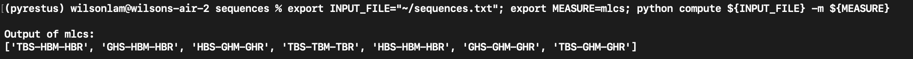

# Sequence Analyses

This module offers the computation of Multiple Longest Common Subsequence (MLCS), Similarity Measures (Dice, Jaccard, Overlap Coefficients), and permuting sequences with identical timestamps.

### Preparation

To execute the module in command line, follow the steps below.

#### 1. Clone the main repository

```
git clone https://github.com/wilys-json/pyrestus
```

#### 2. Setup the environment

*Note: the commands below will install packages in the base environment. For virtual environments, please use `virtualenv` or `conda`*

```
cd pyrestus
pip install -r requirements-core.txt
pip install -r requirements.txt
```

#### 3. Navigate to the `sequences` module

```
cd sequences
```

#### 4. Execute the `compute` program

*Note: the default measurement is MLCS, you can also choose from:*

(1) `dice` : Dice Score Coefficient - function under testing

(2) `jaccard` : Jaccard Index - function under testing

(3) `overlap` : Overlap Coefficient - function under testing

(4) `mlcs` (default) : Multiple Longest Subsequence - tested

(5) `permute` : permuting sequences with identifical timestamp - function under testing


```
export INPUT_FILE=/path/to/input/file
export MEASURE={measure from above}

python compute ${INPUT_FILE} -m ${MEASURE}
```

sample:



#### 5.  File format preparations

To use the command line program, sequence files should be prepared with respect to the target metric to be used.

##### *MLCS*

To compute the Multiple Longest Common Subsequences (MLCSs), the file should follow the format below:

```
event1-event2-event3
event2-event1-event3
event3-event2-event1
```

each event / representing symbol should be separated by the `-` sign, and a new sequence should be in a new line.
Accepted file formats are .csv and .txt.


